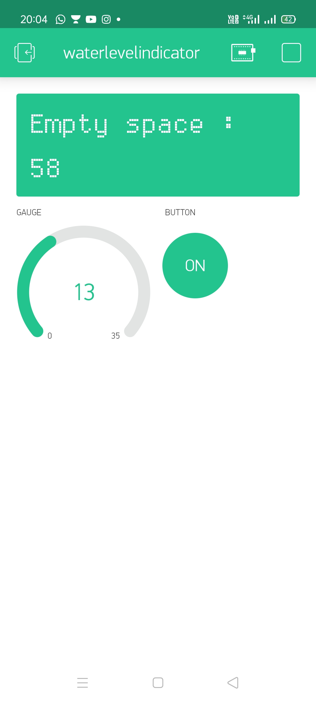
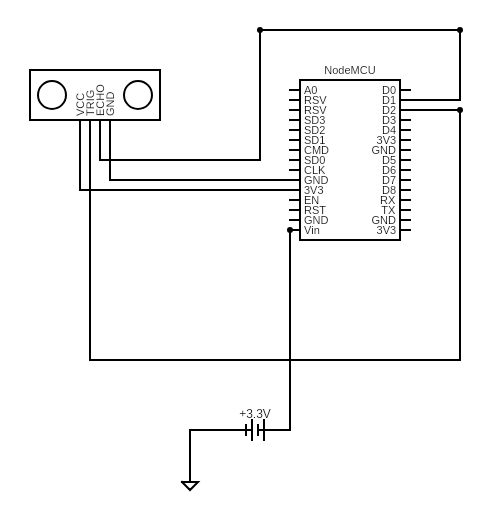

# Water-Level-Indicator
A short project to prevent careless wastage of water

It uses ESP8266 NodeMCU module for remote operation through BlynkIoT Cloud.
Provides with live monitoring of water level and estimated water quantity.

Circuit Diagram 

